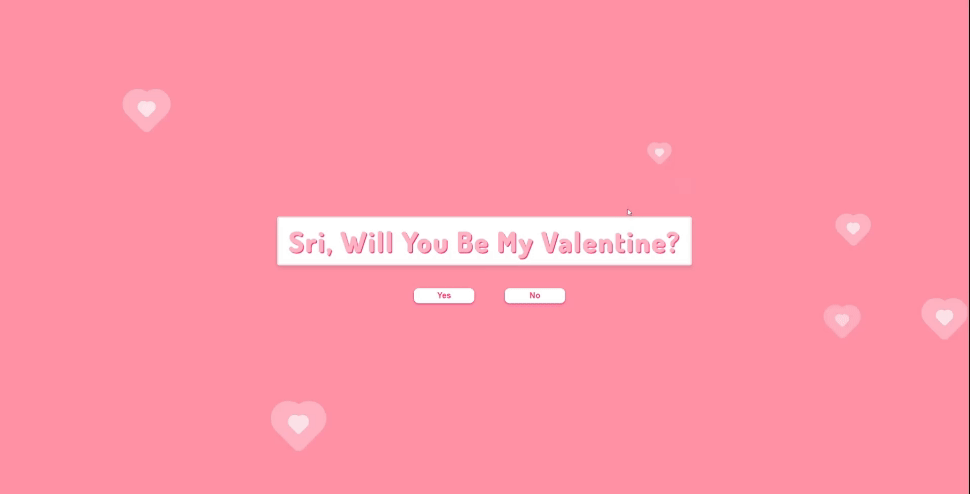

# Valentine's Day Card

A cute Valentine's Day card website I created for my girlfriend in 2024. This repo is to showcase my mini personal project, featuring the non-deployment code.

I primarily used JavaScript for the animations, music, confetti effects, Polaroid picture interactions, and the password-protected note (note: this file has been removed for the purpose of this public repository).

I also had registered a domain with her full name as a part of her gift but took it down for privacy reasons. However, you can still check out the project here: [https://myvalentine88.netlify.app/](https://myvalentine88.netlify.app/)

